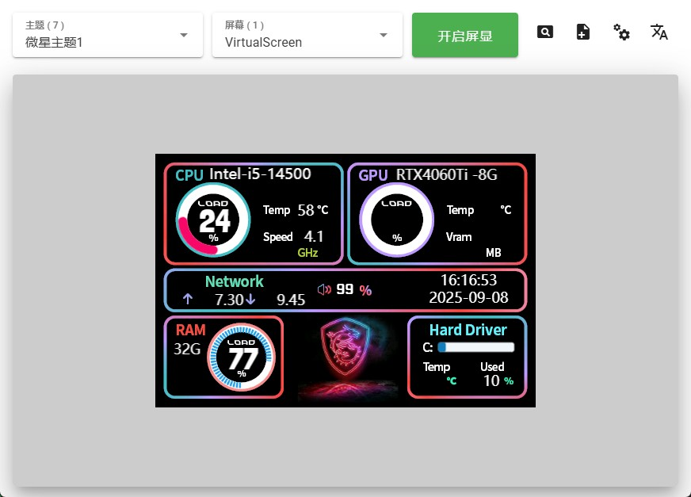

# LCD CANVAS —— 轻松在你的LCD副屏上绘制内容

### [English](./README_en.md)


## 简介:

这是一个LCD副屏上位机软件开源项目，主要功能是控制通过USB连接的LCD屏幕显示内容。目前仅支持在Windows平台上运行, 支持win7/win8/win10/win11。软件界面支持中英文双语切换, 并在软件内置了一个虚拟屏幕, 用于在桌面上模拟显示内容。主题文件可以前往
<a href="https://lcdcanvas.com/themeeditor" target="_blank">lcdcanvas.com</a>
自由的在线创建与编辑, 保存为JSON文件到本地后导入到上位机软件中使用。

## 软件截图:



## 支持的屏幕:

如果您是LCD副屏的制造商, 希望此开源项目适配您的屏幕或者想要定制私有版本, 可以联系
<a href="mailto:kerbalwzy@gmail.com?subject=LCDCANVS定制开发" target="_blank">kerbalwzy@gmail.com</a>
如果您具有开发能力, 可以Fork本项目后, 自己实现屏幕的适配功能, 并提交PR到本项目中。

| 序列号 | 尺寸 | 分辨率 | 代码 | 制造商 | 授权协议 |
| --- | --- | --- | --- | --- | --- |
| VirtulScreen | 无限制 | 跟随主题 | [VirtualScreen.py](./libs/lcds/VirtualScreen.py) | - | - |


## 使用方法:

- 在
  <a href="https://github.com/kerbalwzy/lcdcanvas/releases" target="_blank">Releases</a>
  中下载最新版本的软件安装包, 双击即可安装使用。

- 通过源码运行 *注意: 当前项目仅支持在Windows平台上运行*
  1. 安装
    <a href="https://www.python.org/downloads/release/python-3810/" target="_blank">Python3.8.10</a>
   
  2. 下载源码:
     ```bash
     git clone https://github.com/kerbalwzy/lcdcanvas.git
     ```     
   
  3. 安装依赖:
     ```bash
     pip install -r requirements.txt
     ```
  
  4. 执行以下命令运行软件:
     ```bash
     python main.py
     ```

## 功能特点:

- 支持中英文双语切换(天气的文本描述, 也会跟随语言切换)
- 内置虚拟屏幕, 用于在桌面上模拟显示内容, 虚拟屏幕没有尺寸限制, 分辨率跟随主题
- 支持在开启屏显后热切换屏幕, 主题, 实时调整亮度, 旋转角度等, 无需重启
- 通过经纬度获取任意地点天气信息, 并支持您设置私有的API Key
- 托盘图标左键单击打开主页窗口, 右键单击打开菜单选项
- 支持设置开机自启(通过源代码运行时无效)
- 屏幕配置记忆, 切换屏幕后, 会自动恢复到上次的配置

## 主题文件:

主题文件是一个JSON文件, 用于描述屏幕的显示内容。创建或编辑主题文件, 请前往
<a href="https://lcdcanvas.com/themeeditor" target="_blank">lcdcanvas.com</a>

## 开源协议:

本项目采用
<a href="https://creativecommons.org/licenses/by-nc-sa/4.0/legalcode" target="_blank">CC BY-NC-SA 4.0</a>
开源协议, 您个人可以自由的使用、修改、分发本项目的源代码, 但必须保留原作者信息和使用相同的许可协议发布。禁止将本项目的内容用于商业目的, 除非您获取到我的授权。

本项目在```libs/lhm```中包含 LibreHardwareMonitor.dll，这是一个根据 Mozilla 公共许可证 2.0（MPL 2.0）授权的开源硬件监控库。该 DLL 文件未被修改。
<a href="https://github.com/LibreHardwareMonitor/LibreHardwareMonitor" target="_blank">LibreHardwareMonitor 的源代码</a>

