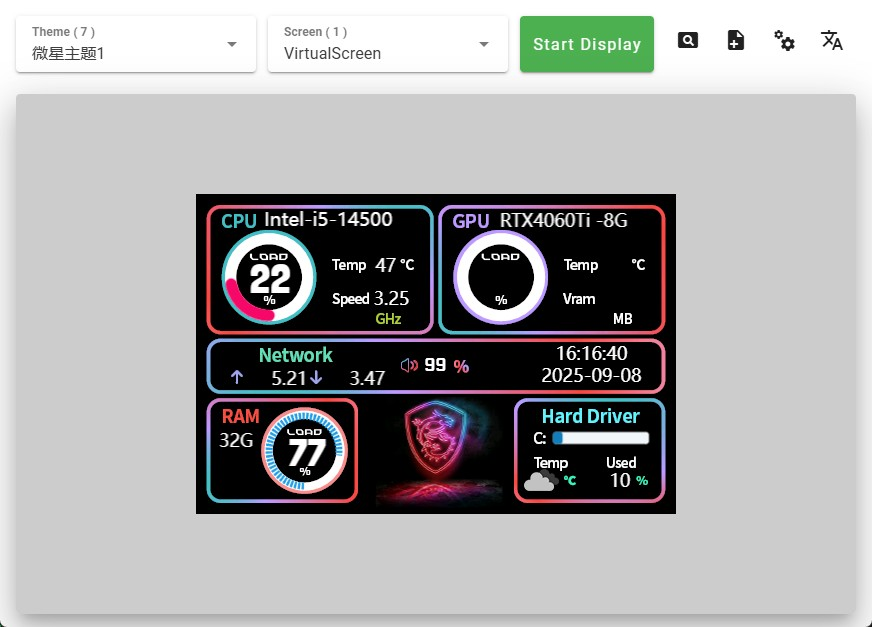

# LCD CANVAS —— Easily Draw Content on Your LCD Secondary Screen

### [中文](./README.md)


## Introduction:

This is an open source project for LCD secondary screen host software. Its main function is to control the LCD screen display content connected via USB. Currently it only supports running on Windows platform, supporting win7/win8/win10/win11. The software interface supports bilingual switching between Chinese and English and includes a built-in virtual screen to simulate display content on the desktop. Theme files can be freely created and edited online at 
<a href="https://lcdcanvas.com/themeeditor" target="_blank">lcdcanvas.com</a>
, saved as JSON files locally, and then imported into the host software for use.

## Software Screenshot:



## Supported Screens:

If you are an LCD secondary screen manufacturer and would like this open-source project to support your screen or wish to customize a private version, you can contact [kerbalwzy@gmail.com](mailto:kerbalwzy@gmail.com?subject=LCDCANVS%20Custom%20Development). If you have development skills, you can fork this project, implement screen compatibility yourself, and submit a PR to this project.

| Serial No. | Size | Resolution | Code | Manufacturer | License |
| --- | --- | --- | --- | --- | --- |
| VirtulScreen | Unlimited | Follow The Theme | [VirtualScreen.py](./libs/lcds/VirtualScreen.py) | - | - |
| WCH32 | 3.5 | 480x320 | [SN_WCH32.py](./libs/lcds/SN_WCH32.py) | <a href="http://www.qdtft.com/" target="_blank">QDTFT</a> | - |

## Usage:

- Download the latest software installation package from
  <a href="https://github.com/kerbalwzy/lcdcanvas/releases" target="_blank">Releases</a>
  and double-click to install and use.

- Run from Source Code *Note: This project currently only supports running on the Windows platform*
  1. Install
     <a href="https://www.python.org/downloads/release/python-3810/" target="_blank">Python3.8.10</a>

  2. Download the source code:
      ```bash
      git clone https://github.com/kerbalwzy/lcdcanvas.git
      ```

  3. Install dependencies:
      ```bash
      pip install -r requirements.txt
      ```

  4. Run the software:
      ```bash
      python main.py
      ```

## Features:

- Supports bilingual switching between Chinese and English (weather descriptions will also follow the language switch)
- Built-in virtual screen for simulating display content on the desktop, with no size limit and resolution following the theme
- Supports hot-switching of screens, themes, real-time adjustment of brightness, rotation angle, etc. after turning on the display, without the need to restart
- Obtain weather information for any location through latitude and longitude, and supports setting your private API Key
- Left-click the tray icon to open the main window, right-click to open the menu options
- Supports setting auto-start on boot (invalid when running through source code)
- Screen configuration memory, automatically restores to the last configuration after switching screens
  
## Theme File

A theme file is a JSON file used to describe the display content of the screen. To create or edit theme files, please visit
<a href="https://lcdcanvas.com/themeeditor" target="_blank">lcdcanvas.com</a>.

## License

This project is licensed under the
<a href="https://creativecommons.org/licenses/by-nc-sa/4.0/legalcode" target="_blank">CC BY-NC-SA 4.0</a>
open-source license. Individuals are free to use, modify, and distribute the source code of this project, but must retain the original author information and release it under the same license. Using the content of this project for commercial purposes is prohibited unless you obtain my authorization.

This project includes LibreHardwareMonitor.dll in the ```libs/lhm```directory, an open-source hardware monitoring library licensed under the Mozilla Public License 2.0 (MPL 2.0). This DLL file has not been modified.
<a href="https://github.com/LibreHardwareMonitor/LibreHardwareMonitor" target="_blank">Source code for LibreHardwareMonitor</a>